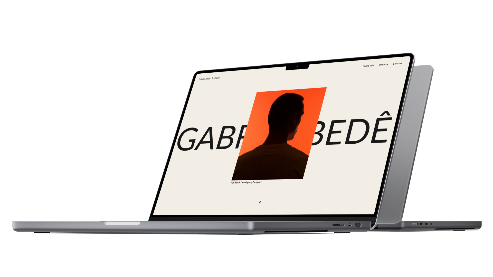

# 🚀 Portfolio - Gabriel Bedê

Bem-vindo ao repositório do meu portfolio pessoal! Eu sou Gabriel Bedê, recém-formado no Ensino Médio com Habilitação Técnica Profissional em Desenvolvimento de Sistemas pela Etec de Guarulhos. Sou um entusiasta da tecnologia e da magia que acontece quando a programação se une à inovação e ao design. Aqui, você encontrará uma visão detalhada do meu percurso acadêmico, habilidades e projetos que expressam minha paixão por programação e design.

  

## ✏️ Protótipo

Você pode visualizar o protótipo do meu portfolio no Figma para ter uma visão mais detalhada do design e layout:

[Link para o Protótipo no Figma](https://www.figma.com/file/yVhDX9RAmSUfPwdv69mdjT/Portf%C3%B3lio---Gabriel-Bed%C3%AA?type=design&node-id=0%3A1&mode=design&t=1GA4S5j3tp7wyo2D-1)

  
     
